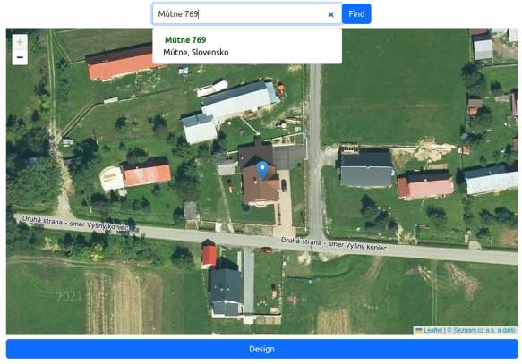
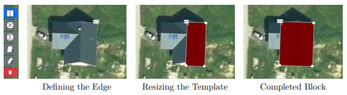
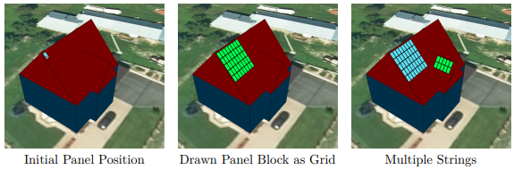

# Web App for Solar Panel Positioning - frontend

## Project Description

This project is a front-end web application that enables users to model a house, place solar panels on it, and estimate the performance of these panels. 

The application provides a user-friendly interface for designing the layout of a house and the optimal placement of solar panels. After modeling, it simulates the solar energy performance and presents the results through intuitive visualizations.

*Choose location from map with a little help by address search with autosuggest*

*Three step block drawing mechanism*

## Installation and Running
1. Clone the repo
2. Install dependencies
    Navigate to the project directory and run
    
    `npm install`
3. Run the application by command

    `npx vite`

    This will launch the application on a local server.